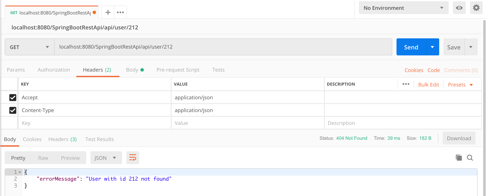
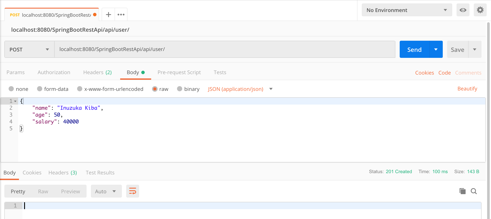

# Spring Boot Rest Api Example
## Things to do:
### Clone this project:
```
git clone https://github.com/hendisantika/SpringBootRestApiExample.git 
```

### Go to the folder
```
cd SpringBootRestApiExample
```
### To run this project
`mvn clean spring-boot:run`

### Open your browser :
http://localhost:8080/SpringBootRestApi

### Open Your Favorite REST Client App (I am using POSTMAN)

#### Get All Users


Request:
```
http localhost:8080/SpringBootRestApi/api/user/
```

Response:
```
HTTP/1.1 200 
Content-Type: application/json;charset=UTF-8
Date: Wed, 10 Apr 2019 12:22:41 GMT
Transfer-Encoding: chunked

[
    {
        "age": 30,
        "id": 1,
        "name": "Naruto",
        "salary": 70000.0
    },
    {
        "age": 40,
        "id": 2,
        "name": "Sasuke",
        "salary": 50000.0
    },
    {
        "age": 45,
        "id": 3,
        "name": "Sakura",
        "salary": 30000.0
    },
    {
        "age": 50,
        "id": 4,
        "name": "Kakashi",
        "salary": 40000.0
    },
    {
        "age": 50,
        "id": 5,
        "name": "Minato",
        "salary": 40000.0
    },
    {
        "age": 50,
        "id": 6,
        "name": "Sarutobi",
        "salary": 40000.0
    },
    {
        "age": 50,
        "id": 7,
        "name": "Orochimaru",
        "salary": 40000.0
    },
    {
        "age": 50,
        "id": 8,
        "name": "Jiraiya",
        "salary": 40000.0
    },
    {
        "age": 50,
        "id": 9,
        "name": "Tsunade",
        "salary": 40000.0
    },
    {
        "age": 50,
        "id": 10,
        "name": "Kiba",
        "salary": 40000.0
    },
    {
        "age": 50,
        "id": 11,
        "name": "Hyuuga",
        "salary": 40000.0
    },
    {
        "age": 50,
        "id": 12,
        "name": "Hinata",
        "salary": 40000.0
    },
    {
        "age": 50,
        "id": 13,
        "name": "Shino",
        "salary": 40000.0
    },
    {
        "age": 50,
        "id": 14,
        "name": "Ten-ten",
        "salary": 40000.0
    },
    {
        "age": 50,
        "id": 15,
        "name": "Rock Lee",
        "salary": 40000.0
    }
]

```


#### Get User By Id


Request:
```
http localhost:8080/SpringBootRestApi/api/user/1
```

Response:
```
HTTP/1.1 200 
Content-Type: application/json;charset=UTF-8
Date: Wed, 10 Apr 2019 12:24:19 GMT
Transfer-Encoding: chunked

{
    "age": 30,
    "id": 1,
    "name": "Naruto",
    "salary": 70000.0
}
```
#### Get Unknown user



Request:
```
http localhost:8080/SpringBootRestApi/api/user/212
```
Response:
```
HTTP/1.1 404 
Content-Type: application/json;charset=UTF-8
Date: Wed, 10 Apr 2019 12:43:02 GMT
Transfer-Encoding: chunked

{
    "errorMessage": "User with id 212 not found"
}
```
#### Add New User


Request:
```
http POST localhost:8080/SpringBootRestApi/api/user/ name=Uchiha\ Madara age=165 salary=75000
```
Response:
```
POST /SpringBootRestApi/api/user/ HTTP/1.1
Accept: application/json, */*
Accept-Encoding: gzip, deflate
Connection: keep-alive
Content-Length: 58
Content-Type: application/json
Host: localhost:8080
User-Agent: HTTPie/1.0.2

{
    "age": "165",
    "name": "Uchiha Madara",
    "salary": "75000"
}

HTTP/1.1 201 
Content-Length: 0
Date: Wed, 10 Apr 2019 12:59:44 GMT
Location: http://localhost:8080/SpringBootRestApi/api/user/16
```


#### Update User by Id


Request:
```
http put localhost:8080/SpringBootRestApi/api/user/13 name=Aburame\ Shino age=50 salary=40000
```
Response:
```
HTTP/1.1 200 
Content-Type: application/json;charset=UTF-8
Date: Wed, 10 Apr 2019 13:07:02 GMT
Transfer-Encoding: chunked

{
    "age": 50,
    "id": 13,
    "name": "Aburame Shino",
    "salary": 40000.0
}
```
#### Delete User by Id


Request:
```
http delete localhost:8080/SpringBootRestApi/api/user/13
```
Response:
```
HTTP/1.1 204 
Date: Wed, 10 Apr 2019 12:25:27 GMT
```
Cek User that has been deleted
```
http localhost:8080/SpringBootRestApi/api/user/1

HTTP/1.1 404 
Content-Type: application/json;charset=UTF-8
Date: Wed, 10 Apr 2019 12:26:11 GMT
Transfer-Encoding: chunked

{
    "errorMessage": "User with id 13 not found"
}
```

#### Delete All Users
Request:
```
http delete localhost:8080/SpringBootRestApi/api/user/
```
Response:
```
http delete localhost:8080/SpringBootRestApi/api/user/
```